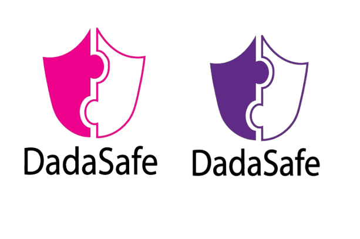
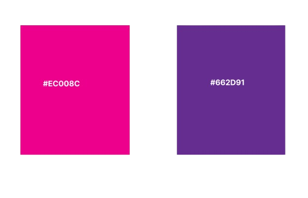

  

    <h1>Logo Usage</h1>
    
Our logo is the core visual identifier for DadaSafe. To maintain brand authority and visual consistency, always use the approved high-resolution vector assets. Ensure proper transparent safe-spacing buffers are maintained around the asset layout boundaries, and never stretch, skew, or distort the logo geometry across application headers.

    
    
  

  

    <h1>Official Colors</h1>
    
The platform UI shifts between primary brand anchors, calming baseline support tones, and predictable alert states. This cohesive layout system guarantees fully accessible color contrast compliance (WCAG AA standards) across both light and dark interface displays for all dashboard metrics and user profiles.

    
    
  

  

    <h1>Typography</h1>
    
Typography is scaled systematically to provide clean, scannable documentation layout pipelines. We utilize highly legible sans-serif typefaces configured with strict line-height scaling variables. This ensures distinct visual priority when rendering system status changes, microcopy descriptions, and complex backend data tables.

    
   <li>
   <h3>code</h3>
   <h3>body </h3>
    <h3>Headings</h3>
   </li>

  

  

    <h1>Imagery and Icons</h1>
    
System actions, dashboard tracking categories, and user navigation panels are supported by clear visual anchors. We employ clean, uniform outline icon packs that map contextually to specific operational behaviors. This simplifies interactions for users tracking their platform workflows and progress metrics.

    
    
  

  
  

    <h1>Example Application</h1>
    
See the visual identity principles combined inside our interface components. This section illustrates how buttons, alert states, navigation headers, and custom typography cards integrate seamlessly into the front-end layout schema to deliver a responsive, accessible user experience.

    
    
  

